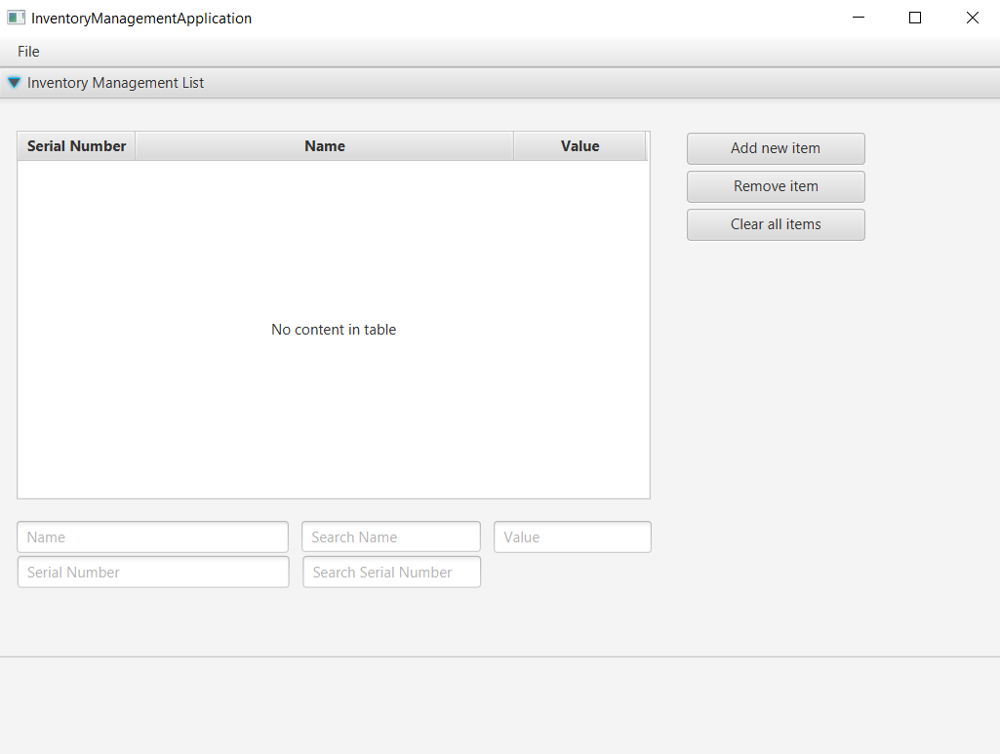
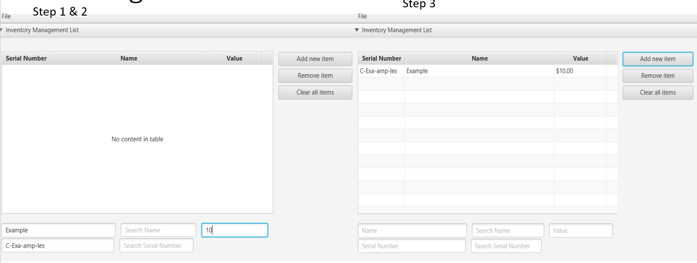
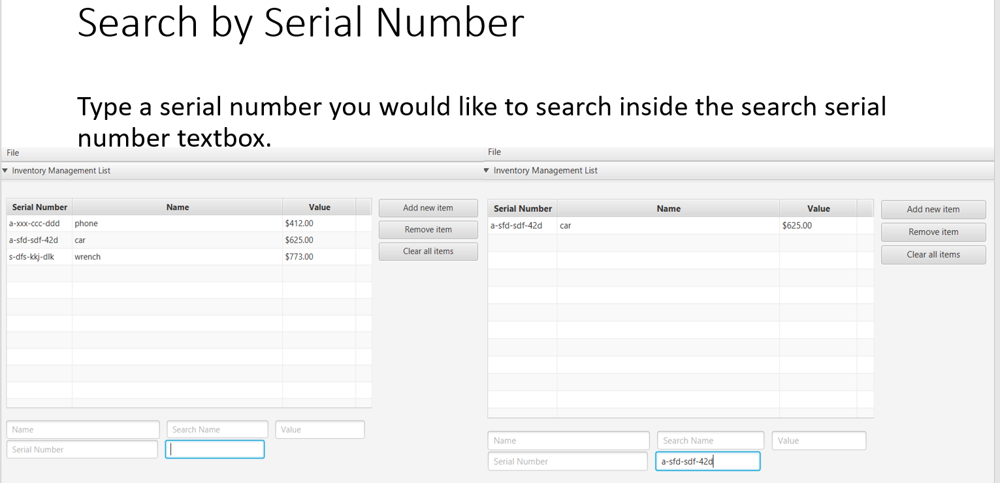
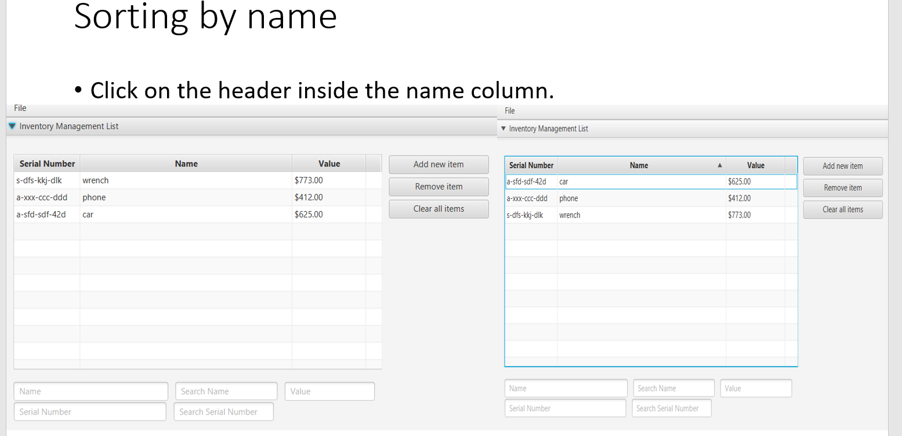

# JavaFX Inventory Manager

A JavaFX desktop application for managing inventory items with search, sorting, validation, and persistent data handling.

## Features
- Add, update, and remove inventory items
- Inventory search and management
- JavaFX graphical user interface (GUI)
- Data validation
- Unit testing

## Technologies Used
- Java
- JavaFX
- Gradle
- JUnit
- Gson
- Jsoup

## Recent Improvements
- Migrated project to JDK 21
- Updated Gradle to version 8.7
- Improved compatibility with modern Java environments

## Screenshots

### Main Interface



### Add Inventory Item



### Search Inventory



### Sorting Inventory Item



## Documentation

User guide, UML diagrams, and supporting documentation are included in the `docs` folder.

## Skills Demonstrated
- Object-Oriented Programming (OOP)
- JavaFX GUI Development
- Data Validation
- Unit Testing
- File Handling
- Gradle Build Automation
- Git/GitHub Version Control

## Installation

```bash
git clone https://github.com/perezm89/javafx-inventory-manager.git
cd javafx-inventory-manager

# Linux / Mac
./gradlew run
```

### Windows

```cmd
gradlew.bat run
```